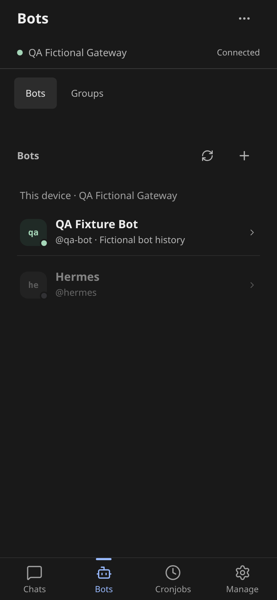
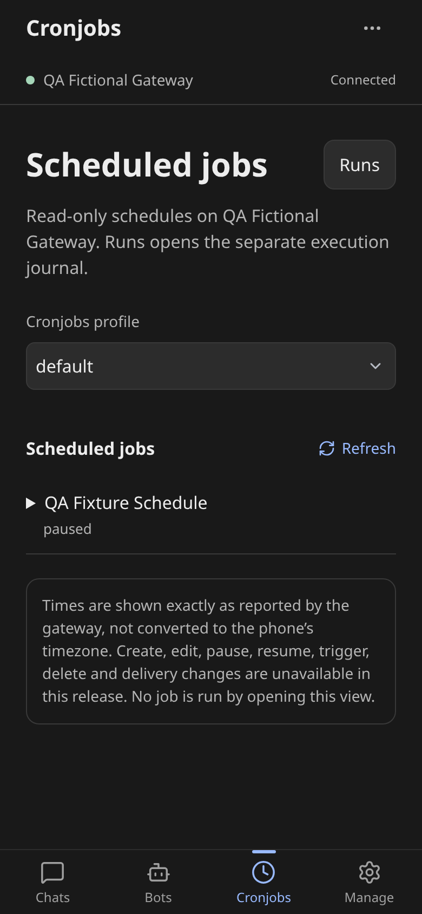
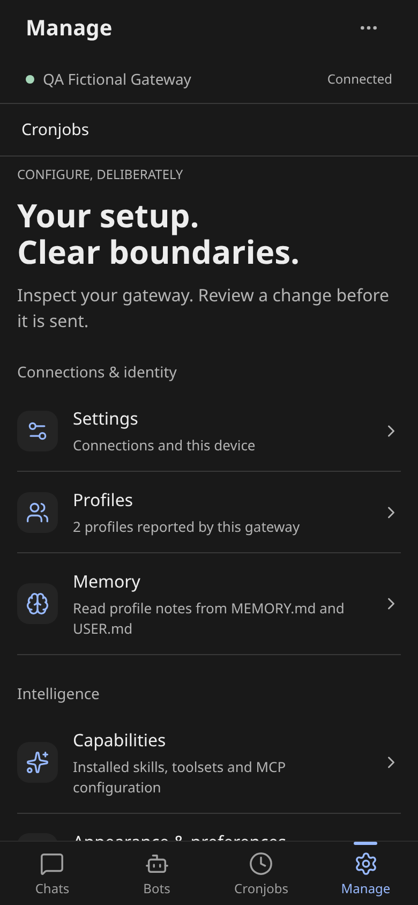

# hermes-mobile

**Unofficial** phone app for [Hermes Agent](https://github.com/NousResearch/hermes-agent). Chat with **your** self-hosted gateway from a browser, then Add to Home Screen.

> Independently developed; not affiliated with or endorsed by Nous Research. Not an official Hermes app. There is no public hosted demo.

The gateway runs the agent (`hermes serve`). This repo is the PWA client. Reach it over a **Tailscale tailnet** (recommended) or LAN.

## Install

You need an authenticated Hermes gateway with basic username/password, reachable from the phone, plus Node and npm (use the Node version in [CI](.github/workflows/check.yml)). Run these commands from a fresh repository checkout, never a currently served build directory. For existing deployments, use the [static publisher's operator instructions](deploy/publish-static.py).

```bash
cd app
npm ci --include=dev
npm run build
cd ..
```

Serve `app/dist` **on the same origin** as the gateway (Hermes only allows localhost CORS). On a tailnet:

```bash
# replace your-node.your-tailnet.ts.net with your node's DNS name;
# set dashboard.public_url to https://your-node.your-tailnet.ts.net:8451
# and restart the gateway before running:
sudo ./deploy/serve.sh "$PWD/app/dist" your-node.your-tailnet.ts.net:9119 8451
```

Open that URL on the phone and Add to Home Screen. Any reverse proxy that can mount `/`, `/api`, and `/auth` on one origin also works. Recipe: [`deploy/serve.sh`](deploy/serve.sh).

Local loopback only:

```bash
cd app
HERMES_BACKEND=http://your-gateway-host:9119 npm run dev -- --host 127.0.0.1
```

## Add a device

1. Open the PWA.
2. Tap **Add device**.
3. Enter a label, the gateway URL (`https://node.tailnet.ts.net:8451` or a LAN URL), and username.
4. Save, then tap the device. Enter your password when **Sign in** appears.

**Test** checks reachability and version, not login. Reload and reconnect reuse the gateway session cookie. A missing or expired session prompts sign-in again; signing in to the same device preserves the destination conversation. Temporary gateway failures remain retryable.

## Security notes (v1)

- Saved connections contain host URL, username, local ID and display label only. The app does not persist gateway passwords, session/refresh tokens or WebSocket tickets in `localStorage`, `sessionStorage` or IndexedDB. A typed password is used for the sign-in request, then discarded from the client; browser password-manager behavior is separate.
- Existing connection records are sanitized on read. Legacy passwords and extra fields are removed while valid metadata survives. If replacement fails, the app attempts to remove the old connection key; corrupt records are also removed. When the browser denies both writes and removal, the app can sanitize only its in-memory view. Clear site data manually in that case.
- Authentication remains same-origin: `POST /auth/password-login` establishes the gateway cookie; `POST /api/auth/ws-ticket` uses it to obtain a one-use WebSocket ticket. Cookies are browser-managed. The **gateway**, not this PWA, owns `Set-Cookie`, expiry/refresh behavior, `HttpOnly`, `Secure`, `SameSite`, domain and path. Operators must verify those attributes for their HTTPS installation. Browser JavaScript cannot set `HttpOnly`; this client adds no refresh endpoint or auth provider.
- Offline tests verify cookie restoration against fictional HTTP responses, not the deployed gateway's cookie attributes or refresh behavior. Live gateway verification requires separate operator approval.
- Settings' **Erase Hermes Mobile data** does not clear gateway session cookies or remote data. Clear the site's cookies in the browser to remove that session.
- The separate tracked-runs API key still lives in plaintext `localStorage` under `hermes-mobile.api-server-key`; it is not a gateway session/refresh token. Use a trusted private browser. A tailnet and HttpOnly cookies do not protect an active session from XSS, extensions, or another user of the same browser profile.

## Tabs

Current app: **Chats / Bots / Cronjobs / Manage**. Screenshots are the built React app with **fictional demo data** (labeled "QA ..." / "Connected" in the simulation). No real credentials or private chats.

| Chats | Bots |
| --- | --- |
| [](screenshots/chats.png) | [](screenshots/bots.png) |
| Resume sessions from a folder tree. New chat starts in the device default folder. | Talk to bot profiles, open private threads, or switch to Groups. |

| Cronjobs | Manage |
| --- | --- |
| [](screenshots/cronjobs.png) | [](screenshots/manage.png) |
| Read-only schedules. **Runs** is a separate execution journal. | Inspect profiles, appearance, skills, memory, messaging, Kanban. Not a Desktop settings editor. |

Open a chat to compose, attach files, pick a model, and stream a reply. See the [conversation and appearance gallery](screenshots/README.md) for details.

## Limitations

Unofficial and self-hosted only. Not Hermes Desktop parity and not a hosted SaaS. Missing gateway routes fail visibly. Optional dictation asks for consent and adds text to the draft without sending it; the browser may process audio remotely. See [security notes](#security-notes-v1) for credential handling and remaining limitations.

MIT - see [LICENSE](LICENSE). Hermes Agent is upstream at NousResearch/hermes-agent.
