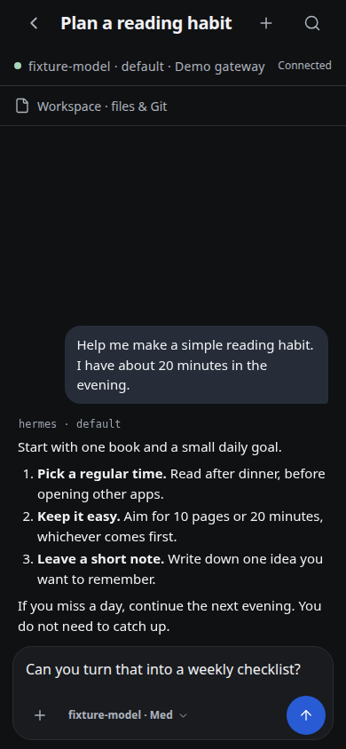
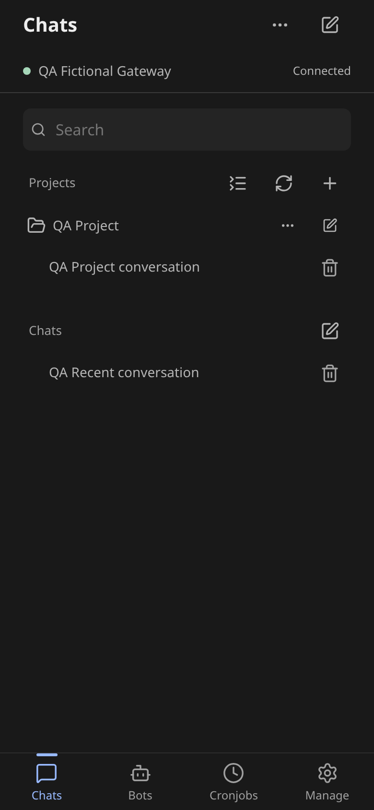
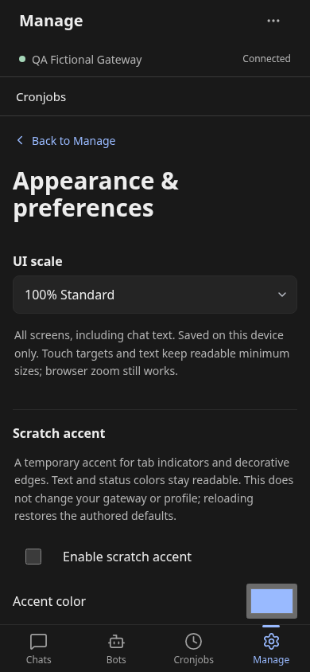

# hermes-mobile

**UNOFFICIAL community client for [Hermes Agent](https://github.com/NousResearch/hermes-agent).** Hermes Mobile is a mobile-first progressive web app (PWA) for chatting with your self-hosted AI agent from a phone browser.

> Independently developed; not affiliated with or endorsed by Nous Research. This is not an official Hermes app.

Connect to your own Hermes gateway (`hermes serve`) over a Tailscale tailnet or LAN. The gateway runs the agent; this repository provides the browser client, not a standalone AI backend or a public hosted demo.

## Screenshots

**Actual app UI shown with demo data.** These captures use the current built React app with fictional conversations and simulated gateway responses, not a design mockup or an authenticated production session. The on-screen “Connected” status belongs to that simulation.

| Chat and composer | Chats | Appearance |
| --- | --- | --- |
| [](screenshots/chat.png) | [](screenshots/chats.png) | [](screenshots/appearance.png) |
| Resume a conversation and draft a reply. | Browse sessions by project and profile. | Adjust the interface on this device. |

Tap a screenshot for the full-size image. Captured at 390 × 844 with 100% Standard UI scale; no real credentials, gateway addresses or private conversations are shown.

## What you can do

- Resume chats, read streaming replies and tool activity, attach files, and respond to explicit command approvals. Composer supports `/exit` (close idle one-to-one Mobile runtime; chat remains resumable) and `/model` (open session model sheet); slash palette only lists these safe commands. Skills and other quick commands stay deferred to gateway/desktop support. Model and reasoning controls also sit inside composer's bottom row.
- Browse Chats with combined Project/Profile filters and local project pins. Groups live under Chats; canonical Bot Chats are also accessible. Pins change display order, not session membership. Deletion is limited to inactive sessions in the verified running profile.
- Open Bots, inspect Cronjobs and tracked Runs, and use Manage for profile/capability inspection, a reviewed profile-description update, bounded memory/schedule/messaging reads and shared Kanban boards. Manage is not a universal configuration editor.
- Read conversation-scoped files and Git status/diffs in Workspace. External previews require explicit trust review; terminal execution and in-app annotation are unavailable.
- Set **Settings → Appearance → UI scale** to 75% Compact, 100% Standard (default), or 125% Large. Appearance stays local to this browser; it does not change the Desktop Accent plugin or gateway/profile defaults.

## Status and limitations

The app has **Home / Chats / Bots / Cronjobs / Manage**, with contextual Workspace tools. It does not have complete Hermes Desktop feature parity or production certification. Gateway support varies by operation; unsupported routes fail visibly.

Credentials currently live in plaintext browser `localStorage`. Use a trusted private device. Secure credential storage, native integrations and physical-device signoff remain open; see [security notes](#security-notes-v1).

## Requirements

- An authenticated Hermes gateway reachable by the same-origin proxy, with a basic username/password provider. An exhaustive compatibility-certified minimum gateway version has not been established. Unsupported routes fail visibly.
- Reachability from your phone: a **Tailscale tailnet** (recommended) or plain LAN.
- A Node version supported by `app/package.json` and the locked Vite dependencies, plus npm. Use the same Node major as the repository CI for reproducible builds.

## Architecture

```
phone browser ──HTTPS (tailscale serve)──► one origin on the tailnet
                                            ├── /          → static PWA (this repo, app/dist)
                                            ├── /api,/auth → configured Hermes gateway
                                            │                └── WS /api/ws?ticket=… (newline-delimited JSON-RPC)
                                            └── /v1        → configured tracked-runs service, when available
```

- **Auth:** password login (`POST /auth/password-login`, provider `basic`) → session cookie → `POST /api/auth/ws-ticket` for a single-use 30s ticket → `ws://…/api/ws?ticket=…`.
- **Wire protocol:** newline-delimited JSON-RPC 2.0. Methods used: `session.list`, `session.create`, `session.resume`, `prompt.submit`, `approval.respond`. Server pushes `event` frames (`gateway.ready`, `message.start/delta/complete`, `tool.start/complete`, `approval.request`, …).
- **Client core:** [`app/src/lib/hermes-client.ts`](app/src/lib/hermes-client.ts) is a pure, React-free module (connection registry, auth, ticket, reconnecting WS JSON-RPC, session CRUD, streaming subscriptions) — reusable as-is from a future Flutter/native shell.

## Quickstart — development

```bash
cd app
npm ci --include=dev
# replace your-gateway-host with the hostname or IP of your own gateway:
HERMES_BACKEND=http://your-gateway-host:9119 npm run dev -- --host 127.0.0.1
```

Open the printed `localhost` URL. This example explicitly binds development to loopback. The Vite dev server proxies `/api` + `/auth` (including the WebSocket upgrade) to the backend, so dev is same-origin. For phone access, deploy your own same-origin HTTPS endpoint using the operator setup below; the loopback development server is not a hosted demo.

The optional live smoke test authenticates, creates a real session and sends a real prompt, which may incur provider cost. It reads local gateway credentials and is not part of the offline/CI release gate. Run it only with explicit operator approval:

```bash
npm run smoke -- "$HERMES_BACKEND"   # explicit operator approval required; sends a real prompt
```

## Updating an existing deployment

Build and test in an isolated worktree/output directory; never run Vite against a currently served `app/dist`, because its cleanup can remove assets still needed by open clients. Commit/push alone does not update an existing Tailscale filesystem mount. Keep old hashed assets available for open clients.

[`deploy/publish-static.py`](deploy/publish-static.py) is an installation-specific publisher. Its target is fixed by the operator-owned `~/.config/hermes-mobile/publisher.json`, outside the repository. It refuses missing, invalid, or group/world-accessible configuration and accepts no target overrides on the command line. It defaults to a read-only dry-run and does not build, change routes, restart services, prune files or roll back. Do not change its configuration or guards merely to make a release pass.

During initial operator setup, create that file with mode `0600`, substituting the actual absolute mount path and HTTPS origin (no trailing slash):

```json
{
  "root": "/absolute/path/to/hermes-mobile/app/dist",
  "origin": "https://gateway.example.invalid:8451"
}
```

Keep installation URLs, tailnet addresses, routing snapshots and release receipts outside public Git history, PR descriptions, comments and screenshots. Public examples and test fixtures must use fictional endpoints. Existing operators must migrate their previous fixed publisher values into this private file before the next release; missing configuration fails closed.

For that installation, an operator first reviews the source and isolated build, freezes a JSON object mapping every artifact-relative path to its SHA-256, and records the manifest digest plus independently reviewed live-entry and complete Serve-route digests. Keep the artifact and manifest outside the live tree and the manifest outside the artifact. Manifest keys are relative POSIX paths; digests are lowercase SHA-256. The route digest uses UTF-8 `json.dumps(route, sort_keys=True, separators=(",", ":")).encode()` over the complete Serve JSON object. Keep raw routing data and release receipts private.

```bash
# From the reviewed checkout; requires approved, absolute artifact/manifest paths.
python3 -B deploy/publish-static.py \
  --artifact "$APPROVED_ARTIFACT" \
  --manifest "$FROZEN_MANIFEST" \
  --manifest-sha256 "$APPROVED_MANIFEST_SHA256" \
  --expected-entry-sha256 "$EXPECTED_ENTRY_SHA256" \
  --expected-route-sha256 "$EXPECTED_ROUTE_SHA256"
```

Require exit 0 and `status=dry_run`, then separate operator approval before appending the exact `--publish` flag with the same arguments. The publisher retains existing files, refuses changed stable support files and unequal collisions, verifies new hashed assets over HTTPS, and switches entry HTML last. Only exit 0 with `status=published` and `stage=complete` confirms its publication checks. Failure can leave added assets or an already-switched entry; stop and inspect rather than assuming rollback or retrying. Arrange exclusive release access; never bypass refusal with `deploy/serve.sh` or a build in the live directory. Authenticated app operations and physical-device behavior still need separate verification.

## Local checks

The application CI runs lint, unit/transport contracts, typecheck/build, isolated publisher tests and fictional browser fixtures. It does not contact a gateway or deploy the app. Run these from an isolated checkout, not a live serving tree:

```bash
cd app
npm ci --include=dev --ignore-scripts --no-audit --no-fund
npm run lint
npm run test:unit
npm run build
# Requires /usr/bin/google-chrome; uses fictional transport and a disposable profile.
npm run check:production-browser:self-test -- --output /tmp/hermes-mobile-browser
npm run check:production-browser -- --output /tmp/hermes-mobile-browser
cd ..
python3 -B -m unittest discover -s deploy -p 'test_*.py'
```

Additional app regressions remain in [`app/scripts/`](app/scripts/) and the [CI workflow](.github/workflows/check.yml).

## First-time deployment (operator setup)

The following route/configuration setup is for a new installation, not an existing-site update. Changing gateway configuration, restarting a service or exposing a listener requires the operator’s explicit approval.

**Why same-origin?** `hermes serve` hardcodes CORS to localhost origins (`hermes_cli/web_server.py`, `allow_origin_regex` covers only `localhost`/`127.0.0.1`) and validates the HTTP `Host` header and WebSocket `Origin` header against the bound interface plus the hostnames declared in `dashboard.public_url`. There is **no config knob to allow additional CORS origins**. A PWA served from a different origin cannot even read `GET /api/status` responses, and its WS handshake is rejected (verified by probing: foreign `Origin` → no `Access-Control-Allow-Origin`; foreign `Host` → 400; WS with foreign `Origin` → 403 even with a valid ticket). So the app must be served **same-origin with the API** — one small reverse proxy in front of both.

The fewest moving parts on a tailnet is `tailscale serve` alone — it can serve the static build AND proxy the API on one HTTPS endpoint:

```bash
# 1. build the app
cd app && npm install && npm run build   # outputs app/dist

# 2. tell Hermes its browser-facing URL so the Host/Origin guard accepts it.
#    config.yaml (or env HERMES_DASHBOARD_PUBLIC_URL), then restart hermes serve:
#    dashboard:
#      public_url: "https://<your-node>.<tailnet>.ts.net:8451"

# 3. one tailnet HTTPS endpoint (see deploy/serve.sh):
cd ..
sudo ./deploy/serve.sh "$PWD/app/dist" <your-node>.<tailnet>.ts.net:9119 8451
# which runs:
#   tailscale serve --bg --https=8451 --set-path /     dist
#   tailscale serve --bg --https=8451 --set-path /api  http://<your-node>.<tailnet>.ts.net:9119/api
#   tailscale serve --bg --https=8451 --set-path /auth http://<your-node>.<tailnet>.ts.net:9119/auth
```

Two gotchas that recipe works around (both verified against a live backend):

- **`tailscale serve` strips the mount prefix before proxying.** A target of `http://host:9119` for mount `/api` would forward `/api/status` as `/status` (404/405 on the backend). Carrying the prefix in the target URL (`http://host:9119/api`) puts it back. Static path mounts are not affected.
- **Proxy to the address Hermes actually binds**, not `127.0.0.1`, if `hermes serve --host` is a tailnet IP — otherwise the proxy gets connection-refused (502).

Then open `https://<your-node>.<tailnet>.ts.net:8451` on the phone and "Add to Home Screen".

Notes:

- `tailscale serve` forwards the original `Host` header; without step 2 Hermes rejects it with 400/403. `public_url` is the upstream-sanctioned knob — no Hermes code is modified.
- Any reverse proxy that can mount two backends under one origin (nginx, traefik, …) works equally well; `tailscale serve` is just the zero-config TLS option. (Caddy note: its `handle` blocks strip prefixes too — use `handle_path`/targets carefully if you go that route.)

## Bot Mode without a Desktop

Bot Mode (agent-to-agent delegation across gateways) normally relies on the Hermes Desktop plugin relay. This repo ships [`relay-daemon/`](relay-daemon/) — an optional headless companion (Python, systemd unit included) that runs the roster-sync + envelope-drain loops 24/7 so bot replies keep flowing while no Desktop is open. See [`relay-daemon/README.md`](relay-daemon/README.md).

## Security notes (v1)

- Connection credentials are stored in plaintext `localStorage` in the browser profile. A private tailnet does **not** protect that storage from XSS, browser extensions, or another person using the same browser profile. Use only a trusted private browser/device; secure credential handling remains a production-hardening gap.
- Agent/API traffic targets configured gateways. Separately, explicit external-preview actions can open a user-reviewed URL in an isolated tab; normal browser cookie rules still apply.

## License

MIT — see [LICENSE](LICENSE). Hermes Agent itself is upstream at NousResearch/hermes-agent; this repo is an independent client and does not vendor or modify upstream code.
