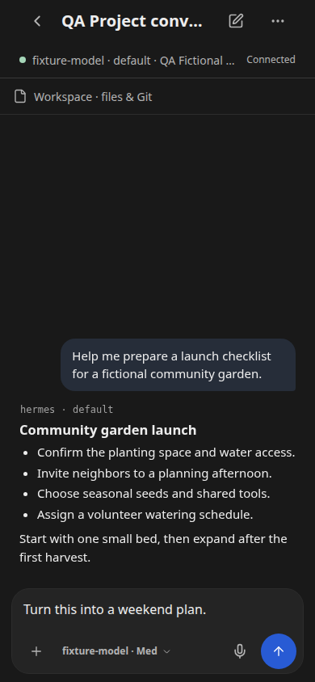

# Feature gallery

The [four-tab overview](../README.md#tabs) covers Chats, Bots, Cronjobs, and Manage. These detail screenshots show the current built app at 390 x 844 with fictional gateway data. Connection status is simulated; no real gateway, credentials, or private conversations are used.

## Conversation and composer

Resume a conversation to read replies and prepare a draft. The composer provides attachment and model controls. The draft shown here has not been sent.

[](conversation.png)

## Appearance

Open **Manage > Appearance & preferences** to choose a UI scale: Compact (75%), Standard (100%), or Large (125%). You can also preview a temporary scratch accent; reloading restores the authored colors.

[](appearance.png)

## Refresh these captures

From the repository root, with Node dependencies installed and Google Chrome available at `/usr/bin/google-chrome`:

```bash
cd app
npm run build
cd ..
node screenshots/capture.mjs
```

The capture script uses the existing fictional transport fixtures and a disposable browser profile inside this directory. Only the loopback server's built assets can reach the network. It does not send prompts or change gateway settings. Inspect both images before committing them.
